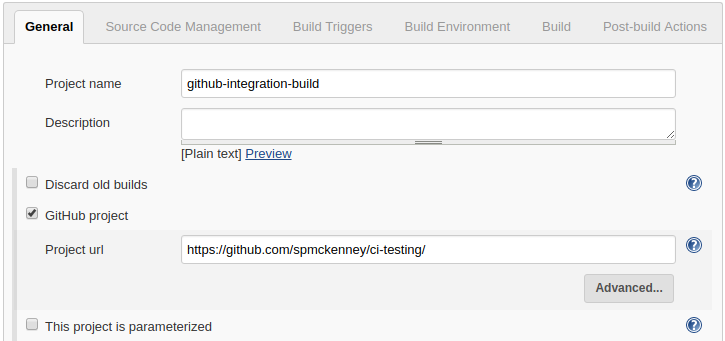
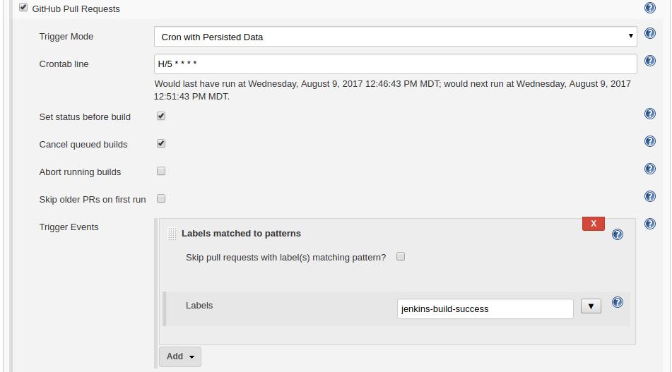
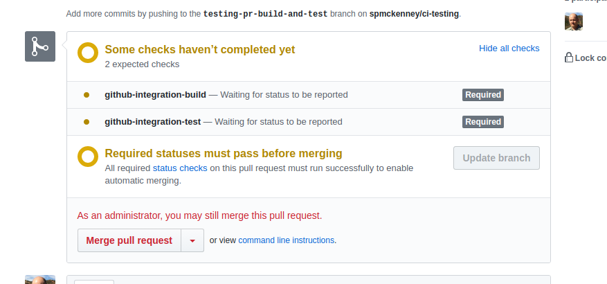
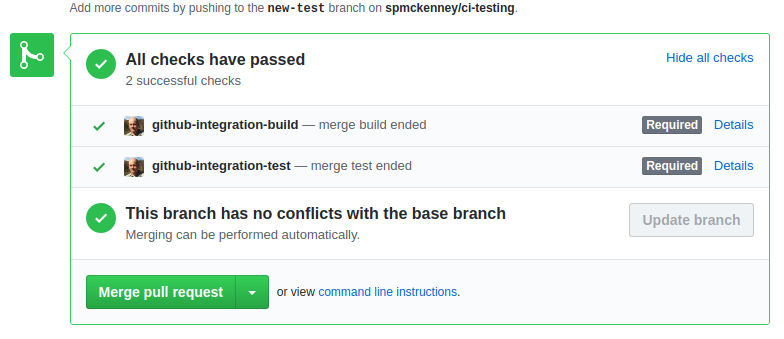

# ci-testing

This project is for miscellaneous testing (CI tests, Jenkins integration, etc).

Currently testing build+test Jenkins jobs

Set GitHub project URL:

Test build triggers:

Required checks:

All checks passed:

Notes:
https://developer.github.com/v3/
http://pygithub.readthedocs.io/en/latest/introduction.html
